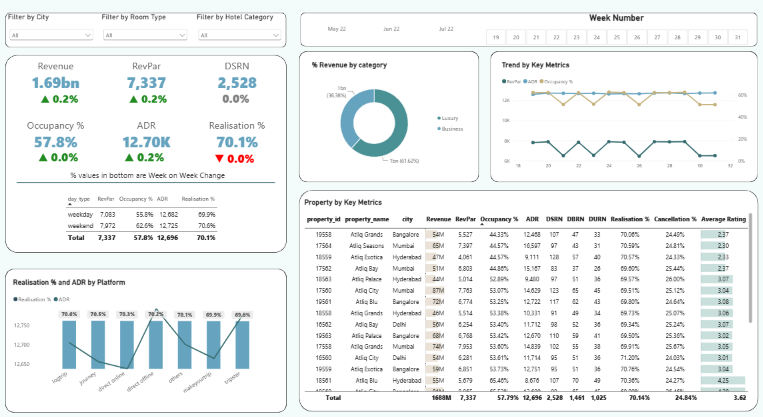

# AtliQ Grands Hospitality Dashboard

## Project Overview
This Power BI dashboard analyzes the performance of AtliQ Grands, a luxury hotel chain operating across multiple cities.

## Objectives
- Track Revenue Performance
- Analyze Occupancy Trends
- Monitor ADR and RevPAR
- Evaluate Booking Platform Performance
- Identify Business Improvement Opportunities

## Tools Used
- Power BI
- Excel
- DAX
- Data Modeling

## Dashboard preview

## Key findings: 
1. ADR remained stable over time, indicating limited pricing flexibility.
2. RevPAR variations were primarily driven by occupancy changes rather than pricing changes.
3. Weekend ADR was comparable to weekday ADR, suggesting missed revenue opportunities during high-demand periods.

## Recommendations:
1. Implement dynamic pricing based on demand patterns.
2. Optimize weekend pricing to capture high-value leisure travelers.
3. Promote own channel through exclusive offers and loyalty perks.

## Author
- [@sarthakbhatnagar40-30](https://github.com/sarthakbhatnagar40-30)

## 🔗 Links

